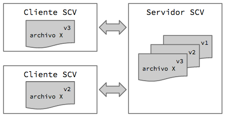

# Introducción
En este capítulos veremos algunas cuestiones conceptuales que nos servirán para entender mejor cómo usar Git.

## Sistemas de control de versiones (SCV)

Los SCV centralizados ofrecen un esquema de trabajo cliente-servidor. Hay un único servidor  central que se encarga de almacenar todos los artefactos y versionarlos. Luego quien quiere trabajar sobre los artefactos que están bajo control de versiones debe utilizar un cliente para conectarse al servidor y descargar una versión específica de los artefactos sobre que los que se desea trabajar. Luego de completado el trabajo, se deben deben enviar las modificaciones al servidor central para que puedan ser accedidas por el resto del equipo. 
La siguiente figura muestra un servidor con varias versiones de un _archivo X_ y dos cliente con distintas versiones de ese _archivo X_. Nótese que cada cliente tiene una única versión del archivo.

Los SCV distribuidos no tienen un servidor central, sino que cada máquina almacena la totalidad de los artefactos con sus correspondientes versiones. En este sentido cada máquina puede potencialmente jugar el rol de servidor.

No voy a entrar en mayor detalle sobre las diferencias y beneficios de cada uno de estos enfoques pues creo que esa información abunda en la web.

## Git es un SCM distruido

Si, Git es distribuido y eso trae algunas particularidades que pueden resultar llamativas para quienes no están acostumbrados a trabajar con SCV distribuidos. Analicemos algunas situaciones para ilustrar esas particularidades.

### Un nuevo miembro se suma al equipo

Consideremos un nuevo miembro sumándose a un equipo de desarrollo que está trabajando en un proyecto usando un SCV. 

En el caso de un SCV centralizado, el nuevo miembro se conectará al servidor y descargará la versión actual del proyecto. Eso implicará descargar una versión específica de cada uno de los archivos que forman parte del proyecto y que están bajo control de versiones. 

Pero si ese equipo estuviera trabajando con Git, el nuevo miembro se descargar el repositorio completo, o sea todas las versiones de todos los archivos, pues esa es la forma en que funciona Git cada uno tiene su propia copia de todo el repositorio.

### Un colaborador esporádico

Supongamos ahora que tenemos una persona que va a hacer una colaboración puntual en el proyecto (por ejemplo editar una hoja de estilos). 

En el caso de SCV centralizados generalmente es posible descargar puntualmente una carpeta, o sea, descargar una versión particular de un subconjunto de archivos. 

Eso no es posible con Git, pues como ya dijimos antes cada colaborador del proyecto tiene una copia completa del repositorio. O sea que este colaborado deberá descargar todas las versiones de todos los archivos.

X> ### Ejercicio 1  
X> Considera la siguiente situación
X>
X> * El primer conjunto de archivos que versionamos (v1) cuenta con 10 archivos y pesa 0.5 MB.
X> * En la siguiente versión (v2) agregamos un nuevo archivo que pesa 5 MB.
X> * En la tercer versión agregamos otros 3 archivos que pesan 1 MB.
X> * En la cuarta versión eliminamos el archivo de 5 MB que habíamos agregado.
X>
X> **¿Cual seria el peso aproximado de descargarse el repositorio para un nuevo colaborador?**

